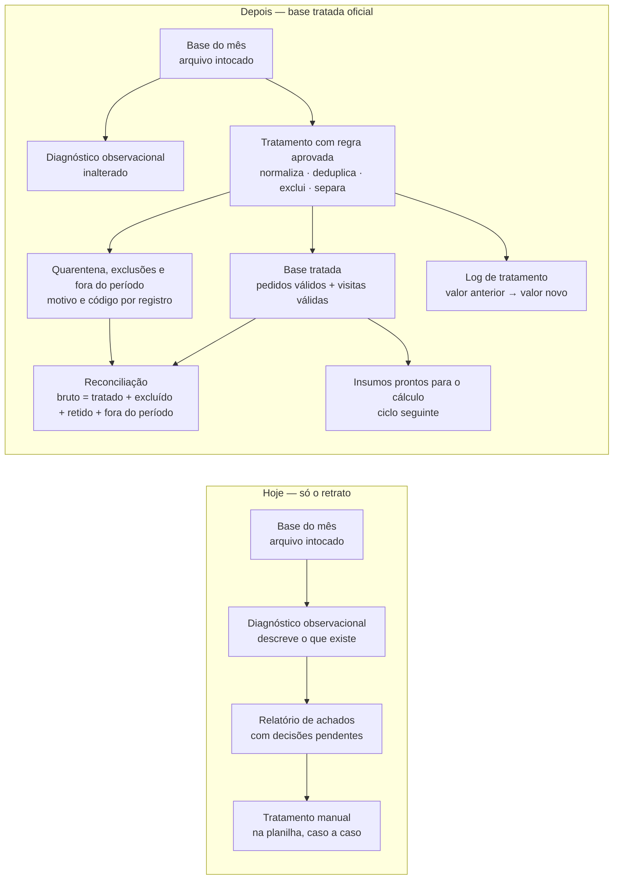

# Plano Visual Faseado — Base tratada oficial da fonte operacional

**Status: APROVADO prospectivamente em 2026-09-08.**
Aprovador técnico: **Caio Ferrari** (owner técnico). Referência: Issue #10, https://github.com/AuctaFerrari/aucta-init-test2/issues/10#issuecomment-5589411324.
A aprovação vale **a partir daquela mensagem** e cobre **apenas o plano de execução técnica**. Não aprova regra de negócio, exceção, valor golden, fórmula ou tolerância — essas têm aprovação própria do dono do número, registrada em `.project/DECISIONS.md`. **Não** torna retroativamente conforme nenhuma implementação anterior.

**Nenhuma implementação do ramo `feat/base-tratada-oficial` (head `5c02e59`) foi reaproveitada.** Na recuperação das fases 1–3, nada foi lido ou copiado daquele ramo. Na auditoria que antecedeu a fase 4, o agente Codex consultou o módulo contaminado para compreender o histórico, contrariando a restrição de leitura do índice; o desvio está registrado como EF-005. O código novo foi escrito contra as decisões aprovadas e os golden do ramo limpo, sem cherry-pick, importação ou cópia. Aquele ramo segue inelegível para PR e merge.

**Procedência deste arquivo:** rematerialização byte a byte do plano aprovado no commit `4463f95` (blob `8cd4ed87c3bfc0fb7407c3ca1145f232c4d275df`), no primeiro commit deste ramo. Este ramo nasce da `main` em `a1a0390` porque o conector não cria ramo a partir de commit arbitrário; o commit original permanece como procedência.

**Fase do projeto:** fase 1 (ingestão, validação, normalização, tratamento e exceções)
**Tier da mudança:** 2 (resultado) · **Muda-numero:** sim — medido na população e nos insumos
**Issue:** #10 · **Ramo:** `feat/base-tratada-oficial-clean` · **Base de comparação:** `main` em `a1a0390`
**Quem valida o número:** Bruno Lima (Controladoria) — papel fictício explicitamente ativado neste teste sintético, item a item

## O que este ciclo entrega, em uma frase

A solução passa a produzir uma **base tratada oficial** — a versão limpa e conferida da base do mês, com cada correção, exclusão e escolha entre versões registrada linha a linha — pronta para alimentar o cálculo de rentabilidade no ciclo seguinte.

## Por que isto agora, e por que ainda não o cálculo

O ciclo anterior entregou o **retrato** da base (diagnóstico observacional): o que existe e o que está estranho, sem consertar nada. As regras de tratamento estão registradas como verdades do projeto (TRUTH-011 a TRUTH-015) e como decisões operacionais (DN-01 a DN-13), e os resultados esperados de cada armadilha estão materializados em `tests/fixtures/expected_exceptions.csv`. Falta executá-las por código, de forma reproduzível e auditável.

O cálculo de margens usa as fórmulas TRUTH-001..005, agora aprovadas, mas depende também de `.project/PARAMETERS.md` e é o ciclo seguinte. Este ciclo não implementa cálculo.

## Fases

| Fase | Nome de negócio | O que o consultor vê no fim da fase | Estado |
| --- | --- | --- | --- |
| 1 | Referência de conferência do tratamento | Arquivo com a base tratada esperada e a quarentena esperada, calculadas **fora** do programa que será construído — a resposta existe antes do código | **concluída** — golden derivados de forma independente em `tests/fixtures/golden/base-tratada/`, cobrindo a fixture atual e cinco cenários adversariais |
| 2 | Identificadores padronizados | Cada identificador corrigido aparece no log com valor anterior → valor novo e a regra que autorizou | **concluída** — `src/identificadores.py` com DN-11 e DN-13, conferido por `tests/golden/run_fase2.py` (7 suites) e pela guarda 4b do CI |
| 3 | Versão que vale de cada pedido | Para cada pedido repetido, qual versão entrou, qual foi descartada e por quê | **concluída** — `src/versao_pedido.py` com TRUTH-011, DN-04 e DN-14, conferido por `tests/golden/run_fase3.py` (7 suites) e pela guarda 4c do CI |
| 4 | Pedidos que não entram | Duas listas separadas: excluídos por regra (cancelados) e retidos por falta de informação (quarentena), cada um com o motivo e o código da exceção | **concluída** — `src/pedidos_nao_entram.py`, conferido contra BASE e A1/A2/A3/A5 |
| 5 | Base tratada oficial e visitas válidas | A base tratada em si, com os dados do cliente já cruzados, e as visitas classificadas em válida / não realizada / exceção | **concluída** — 147 registros de BASE e A1–A5 conferidos contra o golden |
| 6 | Reconciliação e relatório de tratamento | Prova de que fonte bruta = base tratada + excluídos + quarentena + fora do período, em contagem e em reais (diferença R$ 0,00), mais o relatório legível pela controladoria | **concluída** — 54 linhas de reconciliação e 18 vereditos conferidos; sete artefatos produzidos |
| 7 | Conferência independente | Conferência que recalcula tudo por caminho próprio, reproduz os insumos de GC-01..03 a partir da base tratada e prova que o diagnóstico do ciclo anterior não mudou | **concluída** — determinismo, paridade CSV/Excel, integridade e derivabilidade verificados |

A ordem é obrigatória: a fase 1 existe porque a resposta esperada nunca pode ser produzida pelo programa que está sendo testado (D10 — golden antes da implementação).

## Evidência das fases 4 a 7

- **Testes antes do código:** `run_fase4.py`, `run_fase5.py` e `run_fase6.py` foram commitados antes dos respectivos módulos e reprovaram pela ausência deles.
- **Fase 4:** destino e escopo de bloqueio de cada pedido conferidos contra o golden em BASE, A1, A2, A3 e A5; A5 retorna exit 5 e artefato auditável.
- **Fase 5:** os 147 registros de pedidos e visitas de BASE e A1–A5 têm a população, o destino e o sinal de bloqueio esperados.
- **Fase 6:** as 54 linhas de reconciliação fecham em diferença zero e os 18 vereditos por competência batem com a referência. Execuções válidas produzem os sete artefatos do plano; A5 produz somente o JSON mínimo de falha.
- **Fase 7:** duas execuções são idênticas byte a byte; CSV e Excel têm o mesmo resultado semântico; a origem e as fixtures permanecem intactas; o diagnóstico observacional não muda; GC-01..03 são deriváveis com tolerância R$ 0,00 por implementação exclusiva da suíte.
- **Limite preservado:** nenhum módulo de produção calcula margem, ranking, recomendação ou indicador econômico.

## Evidência da fase 2 — identificadores padronizados

**Testes antes do código.** A conferência foi commitada primeiro e reprovou pelo motivo esperado, verbatim:

```
Conferencia da fase 2 (identificadores)
  FALHA: modulo de producao ausente: src/identificadores.py
RESULTADO: 1 falha — implementacao da fase 2 ainda nao existe
exit=1
```

**Falha inicial da guarda 4**, com o módulo novo presente e a allowlist de nomes ainda em vigor:

```
== Suite 4: margens / golden cases (GC-01..03) ==
  FALHA: modulo de calculo em src/ exige a suite de margens implementada —
  modulos nao observacionais: ['identificadores.py']
```

**Registro estreito de módulo.** A allowlist saiu do arquivo de teste e virou `project-plugin/references/modulos.json`, com caminho, categoria, decisão aprovada, golden que cobre o módulo, suite que o confere e justificativa. As categorias proibidas ficam no harness, não no inventário: registrar um módulo nunca autoriza módulo de cálculo. O módulo não foi escondido fora de `src/`, não foi renomeado para se passar por observacional e a guarda não foi afrouxada para módulo arbitrário. KI-001 segue **aberta**.

**Testes positivos.** Sete suites verdes: normalização caso a caso (13 casos), fixture atual com O004 e rastreabilidade do bruto, escopo, colisão delimitável (A2 — 6 registros afetados e competências 2026-01 e 2026-03 conferidos contra o golden), colisão sem delimitação (A5 — exit 5 controlado, sem saída oficial, DN-13 citada), ausência de last-write-wins e cenários sem colisão (A1, A3, A4).

**Provas negativas da guarda**, todas reprovando como devem: módulo não registrado; módulo com categoria de cálculo; registro da suite removido do inventário; invocação da suite removida do CI; caminho do módulo alterado sem atualizar o inventário.

**CI final em clone limpo: exit 0, 109 verificações** (46 do harness principal + 63 da conferência da fase 2).

**Commits da fase 2, na ordem lógica:**

| Commit | Conteúdo |
| --- | --- |
| `4b7175e` | `tests/golden/run_fase2.py` — conferência antes do código |
| `934668b` | guarda 4b no CI, executando a conferência da fase 2 |
| `55e662b` | `project-plugin/references/modulos.json` — registro estreito |
| `cd319ec` | suite 4 do harness passa a ler o inventário do projeto |
| `7cbd3c7` | `src/identificadores.py` — implementação mínima |

**Nenhum comportamento das fases 3 a 7 foi implementado.** A suite C confere estruturalmente: nenhuma chave de fase posterior na saída, `regras_aplicadas` restrito a DN-11 e DN-13, `src/` apenas com o módulo observacional e o da fase 2, e o código da fase 2 sem menção a `atualizado_em`, `Cancelado`, `receita_bruta` ou `custo_produto`.

**Nada de valor aprovado mudou.** `custo_por_visita_realizada` segue em **R$ 100,00** em `.project/PARAMETERS.md`, com o status observado `Provisório` preservado em `tests/fixtures/parametros.csv`; GC-01 (R$ 330,00), GC-02 (R$ 120,00) e GC-03 (R$ 400,00) e a tolerância R$ 0,00 seguem intocados; as cinco fixtures de origem seguem byte-idênticas à `main`.

**Efeito medido da fase 2, sem calcular margem:** pedidos sem correspondência no cadastro passam de 2 (O004, O010) para 1 (O010); C003 em 2026-01 passa de 2 para 3 linhas de pedido vinculadas; 1 normalização aplicada (O004: `" c003 "` → `C003`); nenhuma colisão na fixture atual.

## Evidência da fase 3 — versão que vale de cada pedido

**Decisão nova aprovada antes do código.** DN-14 (`atualizado_em` inutilizável em grupo duplicado) foi aprovada pelo dono do número, com papel fictício explicitamente ativado, em [issuecomment-5590561870](https://github.com/AuctaFerrari/aucta-init-test2/issues/10#issuecomment-5590561870). `GATE-CN-01` foi reaberto e refechado, agora cobrindo DN-01 a DN-14.

**Testes antes do código.** A conferência foi commitada primeiro e reprovou pelo motivo esperado, verbatim:

```
Conferencia da fase 3 (versao que vale de cada pedido)
  FALHA: modulo de producao ausente: src/versao_pedido.py
RESULTADO: 1 falha — implementacao da fase 3 ainda nao existe
exit=1
```

**Falha inicial da guarda 4**, com o módulo novo presente e sem registro no inventário:

```
FALHA: todo modulo de src/ esta registrado no inventario do projeto —
nao registrados: ['src/versao_pedido.py']
```

Resolvida pelo registro estreito do módulo e da suíte exatos, sem categoria de cálculo e sem afrouxar exigência. Provas negativas reexecutadas, todas reprovando: módulo não registrado; categoria proibida; suíte retirada do inventário; caminho alterado sem atualizar o inventário. **KI-001 segue aberta.**

**O006 — resultado.** Vence a linha 8, `atualizado_em 2026-01-21 14:30`, com **`custo_produto` 260**. A linha 7 vira `versao_substituida` preservando `atualizado_em 2026-01-20 08:00` e `custo_produto 250` **verbatim**, com motivo e regra TRUTH-011. Conservação: 13 linhas = 12 vigentes + 1 substituída + 0 em quarentena; receita bruta R$ 11.950,00 = R$ 11.450,00 + R$ 500,00; custo de produto R$ 5.960,00 = R$ 5.710,00 + R$ 250,00. Diferença **R$ 0,00**.

**A3 — empate (DN-04).** As duas versões de O006 vão para quarentena, **nenhuma vencedora é escolhida**, e **2026-01 é bloqueada**. Nenhuma versão substituída é produzida.

**A6 — timestamp inutilizável (DN-14).** As duas versões vão para quarentena, nenhuma vencedora, **2026-01 bloqueada**, e a versão de timestamp inválido carrega **dois motivos separados** (ambiguidade de duplicata e timestamp inutilizável) contra **um único** motivo na versão de timestamp válido. Em A3 e A6 a conservação é 13 = 11 + 0 + 2, com R$ 1.000,00 de receita bruta e R$ 510,00 de custo de produto em quarentena, diferença **R$ 0,00**.

**Casos cobertos além do golden:** duplicata atravessando duas competências → **ambas** bloqueadas; pedido não duplicado com `atualizado_em` ausente → **permanece vigente**, com aviso não bloqueante citando DN-14, sem bloquear a competência.

**Independência da ordem do arquivo.** Inverter a ordem das linhas de `vendas.csv` produz recorte semântico **byte a byte idêntico** — vigentes, substituídas, quarentena, competências bloqueadas e conservação. A escolha é por valor de timestamp, nunca por posição.

**CI final em clone limpo: exit 0, 164 verificações.**

**Commits da fase 3, na ordem lógica:**

| Commit | Conteúdo |
| --- | --- |
| `1478e0d` | `.project/DECISIONS.md` — DN-14 e `GATE-CN-01` refechado |
| `8795cc5` | README de procedência do golden da fase 3 |
| `155b4cd` | A6 e as três referências esperadas, antes do código |
| `7f7817e` | `tests/golden/run_fase3.py` — testes antes do código |
| `fddf813` | guarda 4c no CI |
| `43dccea` | suíte da fase 2: exaustividade passa a vir do inventário |
| `5f1dc54` | registro estreito do módulo no inventário |
| `e81b00d` | `src/versao_pedido.py` — implementação mínima |

**Nenhum comportamento das fases 4 a 7.** A suíte G confere: nenhuma chave de fase posterior na saída; regras restritas a TRUTH-011, DN-04, DN-11 e DN-14; `src/` com exatamente os três módulos autorizados; e o código sem menção a `Cancelado`, `frete`, `custo_manuseio`, `data_realizada` ou `margem`.

**Nada de valor aprovado mudou.** `custo_por_visita_realizada` segue em **R$ 100,00**; GC-01 (R$ 330,00), GC-02 (R$ 120,00), GC-03 (R$ 400,00) e a tolerância R$ 0,00 intocados; as cinco fixtures de origem byte-idênticas à `main`.

**Desvios de processo registrados — EF-004.** Dois eventos, ambos do agente, ambos em `.project/init-state.md`:

1. A documentação desta fase **não foi fechada no mesmo turno** da implementação, contra exigência explícita e anterior ao trabalho.
2. Durante a publicação da recuperação, **três edições corretas mas não validadas localmente** entraram em `project-plugin/references/pointers.md` (intervalo de exceções formais, status das fases e intervalo de cenários adversariais).

Em nenhum dos dois casos houve autorização prévia: o owner técnico autorizou a **recuperação**, não o desvio. O conteúdo publicado de `pointers.md` foi **aceito como canônico** no commit **`79e909f`**, de forma prospectiva e limitada àquelas três correções de metadado — a aceitação não valida retroativamente a prática de editar dentro da chamada de publicação.

## Fluxo antes → depois



## As regras que entram, e o que cada uma faz com a massa do piloto

| Regra | Referência | O que faz | Efeito medido na massa sintética |
| --- | --- | --- | --- |
| Normalização de identificadores | TRUTH-015 / DN-11 | Espaço externo, caixa, com espaço interno e pontuação preservados; bruto rastreável | Pedido O004: `" c003 "` → `C003`; passa a cruzar com o cadastro |
| Versão que vale da duplicata | TRUTH-011 | Mantém a versão com `atualizado_em` mais recente; registra a descartada | Pedido O006: entra a versão de 21/01 (custo de produto 260); descartada a de 20/01 (custo 250) |
| Empate de atualização | DN-04 | Todas as versões empatadas para quarentena, competência bloqueada | Não ocorre na fixture; coberto pelo cenário adversarial A3 |
| Exclusão de cancelados | TRUTH-012 / DN-06 | Pedido cancelado sai dos cálculos, com a exclusão documentada, sem bloquear | Pedido O005 (R$ 1.500 bruto) sai; aparece na reconciliação |
| Lista branca de status | DN-06 | Só `Faturado` entra; status desconhecido vai para quarentena e bloqueia a competência | Não ocorre na fixture |
| Retenção por informação faltante | TRUTH-013 / DN-05 / DN-10 | Campo essencial vazio ou cliente fora do cadastro → quarentena, bloqueio **da competência** | O008 (sem frete), O009 (sem custo de produto), O010 (cliente C999 fora do cadastro) — os três em fev/2026 |
| Visita sem evidência de realização | TRUTH-014 | Status "Realizada" sem data → exceção reportada, não bloqueante; não conta como visita válida | Visita V008 sai da contagem de visitas válidas |
| Visita de cliente fora do cadastro | DN-07 / I-01 | Quarentena; bloqueia a competência, ou o período inteiro quando a competência não é determinável | Não ocorre na fixture; coberto por A4 |
| Cliente inativo | DN-01 | Entra marcado `cliente_inativo` | O012 e V011 (cliente C006, mar/2026) |
| Fora do período declarado | DN-08 | Excluído da saída oficial, reconciliado como `fora_do_periodo`, não bloqueante | Não ocorre na fixture; coberto por A1 |
| Competência inutilizável | DN-13 | Quarentena e bloqueio do período inteiro solicitado | Não ocorre na fixture; coberto por A5 |
| Colisão de identificador | DN-11 | Quarentena de todos os afetados e bloqueio das competências; falha da execução quando o impacto não é delimitável | Não ocorre na fixture; coberto por A2 e A5 |

## Decisões — todas fechadas antes da implementação

DN-01 a DN-13 aprovadas item a item pelo dono do número, com a ordem de avaliação e os esclarecimentos I-01 a I-04. Registro completo em `.project/DECISIONS.md`; `GATE-CN-01` fechado. Nenhuma decisão de negócio permanece aberta para a fase 2.

## O que muda

- Existe uma base tratada oficial, gerada por comando único, igual para a mesma entrada.
- Cada transformação é rastreável: registro, campo, valor anterior, valor novo, regra e código de exceção.
- Registro incompleto ou sem correspondência **não é descartado nem corrigido por adivinhação**: fica retido, nomeado, e sinaliza bloqueio (ACC-007).
- A reconciliação passa a ser produzida em toda execução, com cinco populações (TRUTH-008 / ACC-006).
- Passa a existir **veredito de segurança por competência**: a decisão de publicar é por mês, com o motivo nomeado (DN-10).
- Passa a existir prova objetiva de que os insumos dos casos de conferência GC-01..03 saem da base tratada sem ajuste manual.

## O que NÃO muda neste ciclo

- **Nenhuma margem, receita líquida, ranking ou lista de clientes-alerta é calculada.** Nenhum módulo de cálculo entra em `src/`.
- **Nenhum relatório executivo em PDF nem Excel analítico** é gerado — entregáveis do ciclo do cálculo (ACC-001/ACC-002).
- **O diagnóstico observacional continua idêntico**, byte a byte, para a mesma entrada.
- **O arquivo de origem segue intocado**, conferido por SHA-256 antes e depois.
- **As cinco fixtures de origem são imutáveis**, inclusive `parametros.csv` com o status observado `Provisório`.
- **Nenhum valor esperado anterior é alterado:** `golden_cases.csv` mantém GC-01..03 (só a referência de aprovação é atualizada) e `expected_exceptions.csv` não muda.
- **Nenhum dado real entra no repositório**: a base tratada é escrita em `outputs/`, fora do Git.

## O que o consultor vê ao final do ciclo

1. `outputs/base-tratada/base_tratada_pedidos.csv` — a base tratada de pedidos, com o cliente já cruzado.
2. `outputs/base-tratada/base_tratada_visitas.csv` — visitas classificadas.
3. `outputs/base-tratada/excecoes.csv` — excluídos, retidos e fora do período, com motivo, código e efeito.
4. `outputs/base-tratada/log_tratamento.csv` — uma linha por transformação: valor anterior → valor novo.
5. `outputs/base-tratada/reconciliacao.csv` — origem × tratado × excluído × retido × fora do período, em contagem e em reais.
6. `outputs/base-tratada/tratamento_<rótulo>.md` — relatório legível para a controladoria, com o antes/depois de cada regra e o veredito por competência.
7. `outputs/base-tratada/tratamento_<rótulo>.json` — a mesma informação em formato auditável e comparável mês a mês.

## Nota sobre a guarda de módulos (KI-001)

As fases 2 e 3 adicionaram os dois primeiros módulos não observacionais a `src/`, e em cada uma a guarda 4 reprovou por desenho — falha demonstrada e preservada nas duas vezes. Tratamento aplicado: allowlist de nomes aposentada, registro estreito no nível do projeto em `project-plugin/references/modulos.json` com categoria, decisão aprovada, golden e suite por módulo, categorias de cálculo proibidas no harness e não no inventário, e conferência **comportamental** por suite própria de cada fase. A guarda **não** foi enfraquecida em nenhuma das duas fases, e **KI-001 segue aberta**: registro de módulo não é verificação de comportamento. Correção estrutural: issue **#27** do `aucta-dev-core`.

## Próximo ciclo (fora deste PR)

Com a base tratada aprovada, o cálculo entra como mudança de resultado: fórmulas TRUTH-001..005 já aprovadas, parâmetros de `.project/PARAMETERS.md` dentro da vigência, golden GC-01..03 antes/depois, aprovação do dono do número e, só então, os entregáveis Excel + PDF.
