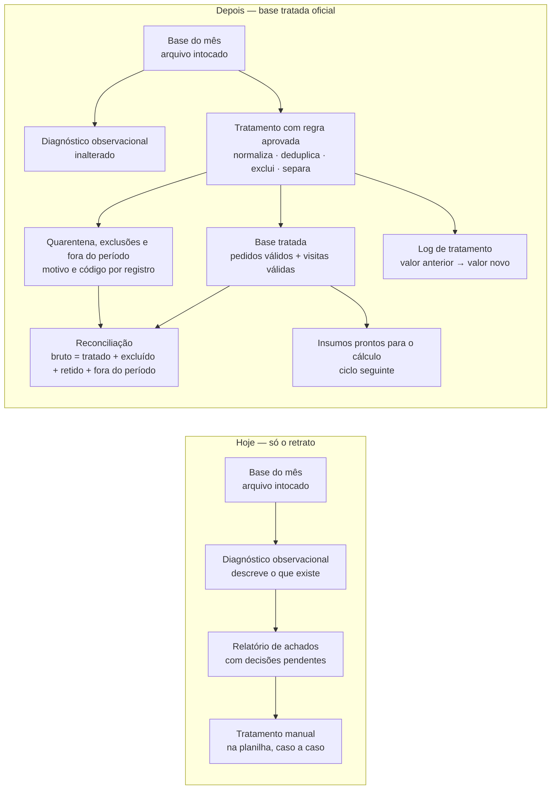

# Plano Visual Faseado — Base tratada oficial da fonte operacional

**Status: APROVADO prospectivamente em 2026-09-08.**
Aprovador técnico: **Caio Ferrari** (owner técnico). Referência: Issue #10, https://github.com/AuctaFerrari/aucta-init-test2/issues/10#issuecomment-5589411324.
A aprovação vale **a partir daquela mensagem** e cobre **apenas o plano de execução técnica**. Não aprova regra de negócio, exceção, valor golden, fórmula ou tolerância — essas têm aprovação própria do dono do número, registrada em `.project/DECISIONS.md`. **Não** torna retroativamente conforme nenhuma implementação anterior.

**Nenhuma implementação do ramo `feat/base-tratada-oficial` (head `5c02e59`) foi reaproveitada.** Nada foi lido, copiado, diferenciado, cherry-picked, importado ou adaptado daquele ramo: nem `src/base_tratada.py`, nem o harness modificado, nem os três arquivos de golden, nem qualquer commit posterior a `4463f95`. Aquele ramo segue como evidência forense e inelegível para PR e merge.

**Procedência deste arquivo:** rematerialização byte a byte do plano aprovado no commit `4463f95` (blob `8cd4ed87c3bfc0fb7407c3ca1145f232c4d275df`), no primeiro commit deste ramo. Este ramo nasce da `main` em `a1a0390` porque o conector não cria ramo a partir de commit arbitrário; o commit original permanece como procedência.

**Fase do projeto:** fase 1 (ingestão, validação, normalização, tratamento e exceções)
**Tier da mudança:** 2 (resultado) · **Muda-numero:** sim — medido na população e nos insumos
**Issue:** #10 · **Ramo:** `feat/base-tratada-oficial-clean` · **Base de comparação:** `main` em `a1a0390`
**Quem valida o número:** Bruno Lima (Controladoria) — papel fictício explicitamente ativado neste teste sintético, item a item

## O que este ciclo entrega, em uma frase

A solução passa a produzir uma **base tratada oficial** — a versão limpa e conferida da base do mês, com cada correção, exclusão e escolha entre versões registrada linha a linha — pronta para alimentar o cálculo de rentabilidade no ciclo seguinte.

## Por que isto agora, e por que ainda não o cálculo

O ciclo anterior entregou o **retrato** da base (diagnóstico observacional): o que existe e o que está estranho, sem consertar nada. As regras de tratamento estão registradas como verdades do projeto (TRUTH-011 a TRUTH-015) e como decisões operacionais (DN-01 a DN-13), e os resultados esperados de cada armadilha estão materializados em `tests/fixtures/expected_exceptions.csv`. Falta executá-las por código, de forma reproduzível e auditável.

O cálculo de margens usa as fórmulas TRUTH-001..005, agora aprovadas, mas depende também de `.project/PARAMETERS.md` e é o ciclo seguinte. Este ciclo não implementa cálculo.

## Fases

| Fase | Nome de negócio | O que o consultor vê no fim da fase | Estado |
| --- | --- | --- | --- |
| 1 | Referência de conferência do tratamento | Arquivo com a base tratada esperada e a quarentena esperada, calculadas **fora** do programa que será construído — a resposta existe antes do código | **concluída** — golden derivados de forma independente em `tests/fixtures/golden/base-tratada/`, cobrindo a fixture atual e cinco cenários adversariais |
| 2 | Identificadores padronizados | Cada identificador corrigido aparece no log com valor anterior → valor novo e a regra que autorizou | não iniciada |
| 3 | Versão que vale de cada pedido | Para cada pedido repetido, qual versão entrou, qual foi descartada e por quê | não iniciada |
| 4 | Pedidos que não entram | Duas listas separadas: excluídos por regra (cancelados) e retidos por falta de informação (quarentena), cada um com o motivo e o código da exceção | não iniciada |
| 5 | Base tratada oficial e visitas válidas | A base tratada em si, com os dados do cliente já cruzados, e as visitas classificadas em válida / não realizada / exceção | não iniciada |
| 6 | Reconciliação e relatório de tratamento | Prova de que fonte bruta = base tratada + excluídos + quarentena + fora do período, em contagem e em reais (diferença R$ 0,00), mais o relatório legível pela controladoria | não iniciada |
| 7 | Conferência independente | Conferência que recalcula tudo por caminho próprio, reproduz os insumos de GC-01..03 a partir da base tratada e prova que o diagnóstico do ciclo anterior não mudou | não iniciada |

A ordem é obrigatória: a fase 1 existe porque a resposta esperada nunca pode ser produzida pelo programa que está sendo testado (D10 — golden antes da implementação).

## Fluxo antes → depois

## As regras que entram, e o que cada uma faz com a massa do piloto

| Regra | Referência | O que faz | Efeito medido na massa sintética |
| --- | --- | --- | --- |
| Normalização de identificadores | TRUTH-015 / DN-11 | Espaço externo, caixa, com espaço interno e pontuação preservados; bruto rastreável | Pedido O004: `" c003 "` → `C003`; passa a cruzar com o cadastro |
| Versão que vale da duplicata | TRUTH-011 | Mantém a versão com `atualizado_em` mais recente; registra a descartada | Pedido O006: entra a versão de 21/01 (custo de produto 260); descartada a de 20/01 (custo 250) |
| Empate de atualização | DN-04 | Todas as versões empatadas para quarentena, competência bloqueada | Não ocorre na fixture; coberto pelo cenário adversarial A3 |
| Exclusão de cancelados | TRUTH-012 / DN-06 | Pedido cancelado sai dos cálculos, com a exclusão documentada, sem bloquear | Pedido O005 (R$ 1.500 bruto) sai; aparece na reconciliação |
| Lista branca de status | DN-06 | Só `Faturado` entra; status desconhecido vai para quarentena e bloqueia a competência | Não ocorre na fixture |
| Retenção por informação faltante | TRUTH-013 / DN-05 / DN-10 | Campo essencial vazio ou cliente fora do cadastro → quarentena, bloqueio **da competência** | O008 (sem frete), O009 (sem custo de produto), O010 (cliente C999 fora do cadastro) — os três em fev/2026 |
| Visita sem evidência de realização | TRUTH-014 | Status "Realizada" sem data → exceção reportada, não bloqueante; não conta como visita válida | Visita V008 sai da contagem de visitas válidas |
| Visita de cliente fora do cadastro | DN-07 / I-01 | Quarentena; bloqueia a competência, ou o período inteiro quando a competência não é determinável | Não ocorre na fixture; coberto por A4 |
| Cliente inativo | DN-01 | Entra marcado `cliente_inativo` | O012 e V011 (cliente C006, mar/2026) |
| Fora do período declarado | DN-08 | Excluído da saída oficial, reconciliado como `fora_do_periodo`, não bloqueante | Não ocorre na fixture; coberto por A1 |
| Competência inutilizável | DN-13 | Quarentena e bloqueio do período inteiro solicitado | Não ocorre na fixture; coberto por A5 |
| Colisão de identificador | DN-11 | Quarentena de todos os afetados e bloqueio das competências; falha da execução quando o impacto não é delimitável | Não ocorre na fixture; coberto por A2 e A5 |

## Decisões — todas fechadas antes da implementação

DN-01 a DN-13 aprovadas item a item pelo dono do número, com a ordem de avaliação e os esclarecimentos I-01 a I-04. Registro completo em `.project/DECISIONS.md`; `GATE-CN-01` fechado. Nenhuma decisão de negócio permanece aberta para a fase 2.

## O que muda

- Existe uma base tratada oficial, gerada por comando único, igual para a mesma entrada.
- Cada transformação é rastreável: registro, campo, valor anterior, valor novo, regra e código de exceção.
- Registro incompleto ou sem correspondência **não é descartado nem corrigido por adivinhação**: fica retido, nomeado, e sinaliza bloqueio (ACC-007).
- A reconciliação passa a ser produzida em toda execução, com cinco populações (TRUTH-008 / ACC-006).
- Passa a existir **veredito de segurança por competência**: a decisão de publicar é por mês, com o motivo nomeado (DN-10).
- Passa a existir prova objetiva de que os insumos dos casos de conferência GC-01..03 saem da base tratada sem ajuste manual.

## O que NÃO muda neste ciclo

- **Nenhuma margem, receita líquida, ranking ou lista de clientes-alerta é calculada.** Nenhum módulo de cálculo entra em `src/`.
- **Nenhum relatório executivo em PDF nem Excel analítico** é gerado — entregáveis do ciclo do cálculo (ACC-001/ACC-002).
- **O diagnóstico observacional continua idêntico**, byte a byte, para a mesma entrada.
- **O arquivo de origem segue intocado**, conferido por SHA-256 antes e depois.
- **As cinco fixtures de origem são imutáveis**, inclusive `parametros.csv` com o status observado `Provisório`.
- **Nenhum valor esperado anterior é alterado:** `golden_cases.csv` mantém GC-01..03 (só a referência de aprovação é atualizada) e `expected_exceptions.csv` não muda.
- **Nenhum dado real entra no repositório**: a base tratada é escrita em `outputs/`, fora do Git.

## O que o consultor vê ao final do ciclo

1. `outputs/base-tratada/base_tratada_pedidos.csv` — a base tratada de pedidos, com o cliente já cruzado.
2. `outputs/base-tratada/base_tratada_visitas.csv` — visitas classificadas.
3. `outputs/base-tratada/excecoes.csv` — excluídos, retidos e fora do período, com motivo, código e efeito.
4. `outputs/base-tratada/log_tratamento.csv` — uma linha por transformação: valor anterior → valor novo.
5. `outputs/base-tratada/reconciliacao.csv` — origem × tratado × excluído × retido × fora do período, em contagem e em reais.
6. `outputs/base-tratada/tratamento_<rótulo>.md` — relatório legível para a controladoria, com o antes/depois de cada regra e o veredito por competência.
7. `outputs/base-tratada/tratamento_<rótulo>.json` — a mesma informação em formato auditável e comparável mês a mês.

## Nota sobre a guarda de módulos (KI-001)

A fase 2 adicionará o primeiro módulo não observacional a `src/`. A guarda 4 do CI reprova, por desenho, qualquer módulo novo — e a limitação registrada em KI-001 é que ela olha **nome de arquivo**, não comportamento. O tratamento previsto: declarar o novo módulo com a sua categoria, manter a proibição de módulo de **cálculo** e cobrir o módulo novo com conferência **comportamental** (contrato de colunas fechado, nenhuma chave de indicador, todo valor conferido contra a fonte). A correção estrutural da guarda segue como demanda do `aucta-dev-core`, e a guarda não será enfraquecida para o código passar.

## Próximo ciclo (fora deste PR)

Com a base tratada aprovada, o cálculo entra como mudança de resultado: fórmulas TRUTH-001..005 já aprovadas, parâmetros de `.project/PARAMETERS.md` dentro da vigência, golden GC-01..03 antes/depois, aprovação do dono do número e, só então, os entregáveis Excel + PDF.
