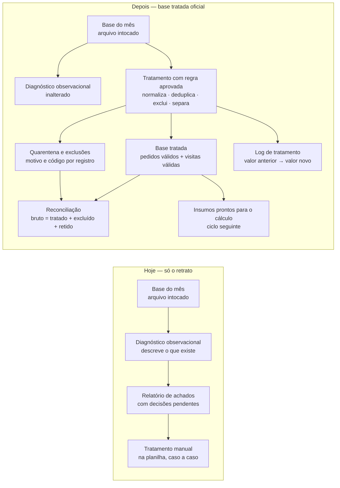

# Plano Visual Faseado — Base tratada oficial da fonte operacional

**Status: APROVADO em 2026-09-08**, pelo owner técnico (Caio Ferrari), antes de qualquer linha de código deste ciclo.
Marcador objetivo de precedência: o commit deste plano (`4463f95`) antecede todo commit de implementação do ramo. A exceção formal EF-002 registrou o descumprimento desse gate no ciclo anterior e **não criou precedente** — revisão de PR não equivale a aprovação de plano.

**Fase do projeto:** fase 1 (ingestão, validação, normalização, tratamento e exceções)
**Tier da mudança:** 2 (resultado) · **Muda-numero:** sim — medido na população e nos insumos
**Issue:** #10 · **Ramo:** `feat/base-tratada-oficial` · **Base de comparação:** `main` em `a1a0390`
**Quem valida o número:** Bruno Lima (Controladoria) — nesta sessão de teste, papel delegado por escrito a Caio Ferrari, com a limitação declarada em `ACCEPTANCE.md`

## O que este ciclo entrega, em uma frase

A solução passa a produzir uma **base tratada oficial** — a versão limpa e conferida da base do mês, com cada correção, exclusão e escolha entre versões registrada linha a linha — pronta para alimentar o cálculo de rentabilidade no ciclo seguinte.

## Por que isto agora, e por que ainda não o cálculo

O ciclo anterior entregou o **retrato** da base (diagnóstico observacional): o que existe e o que está estranho, sem consertar nada. As regras de tratamento já estão registradas como verdades do projeto (TRUTH-011 a TRUTH-015) e os resultados esperados de cada armadilha já estão materializados em `tests/fixtures/expected_exceptions.csv`. Falta executá-las por código, de forma reproduzível e auditável.

O cálculo de margens depende das fórmulas TRUTH-001..005, que seguem **preliminares** até a validação formal da controladoria. Este ciclo não toca nelas.

## Fases

| Fase | Nome de negócio | O que o consultor vê no fim da fase | Estado |
| --- | --- | --- | --- |
| 1 | Referência de conferência do tratamento | Arquivo com a base tratada esperada e a quarentena esperada, calculadas **fora** do programa que será construído — a resposta existe antes do código | concluída (`6c8d041`) |
| 2 | Identificadores padronizados | Cada identificador corrigido aparece no log com valor anterior → valor novo e a regra que autorizou | concluída |
| 3 | Versão que vale de cada pedido | Para cada pedido repetido, qual versão entrou, qual foi descartada e por quê | concluída |
| 4 | Pedidos que não entram | Duas listas separadas: excluídos por regra (cancelados) e retidos por falta de informação (quarentena), cada um com o motivo e o código da exceção | concluída |
| 5 | Base tratada oficial e visitas válidas | A base tratada em si, com os dados do cliente já cruzados, e as visitas classificadas em válida / não realizada / exceção | concluída |
| 6 | Reconciliação e relatório de tratamento | Prova de que fonte bruta = base tratada + excluídos + quarentena, em contagem e em reais (diferença R$ 0,00), mais o relatório legível pela controladoria | concluída |
| 7 | Conferência independente | Conferência que recalcula tudo por caminho próprio, reproduz os insumos de GC-01..03 a partir da base tratada e prova que o diagnóstico do ciclo anterior não mudou | concluída (`8bb1b82`) |

A ordem é obrigatória: a fase 1 existe porque a resposta esperada nunca pode ser produzida pelo programa que está sendo testado (D10 — golden antes da implementação).

## Fluxo antes → depois

## As regras que entram, e o que cada uma faz com a massa do piloto

| Regra | Verdade | O que faz | Efeito medido na massa sintética |
| --- | --- | --- | --- |
| Normalização de identificadores | TRUTH-015 | Remove espaços e uniformiza a caixa antes de qualquer cruzamento | Pedido O004: `" c003 "` → `C003`; passa a cruzar com o cadastro |
| Versão que vale da duplicata | TRUTH-011 | Mantém a versão com `atualizado_em` mais recente; registra a descartada | Pedido O006: entra a versão de 21/01 (custo de produto 260); descartada a de 20/01 (custo 250) |
| Exclusão de cancelados | TRUTH-012 | Pedido cancelado sai dos cálculos, com a exclusão documentada | Pedido O005 (R$ 1.500 bruto) sai; aparece na reconciliação |
| Retenção por informação faltante | TRUTH-013 | Campo essencial vazio ou cliente fora do cadastro → quarentena e sinal de bloqueio de publicação | O008 (sem frete), O009 (sem custo de produto), O010 (cliente C999 fora do cadastro) |
| Visita sem evidência de realização | TRUTH-014 | Status "Realizada" sem data → exceção reportada; não conta como visita válida | Visita V008 sai da contagem de visitas válidas |
| Lista branca de status | TRUTH-016 | Só `Faturado` entra; status novo ou desconhecido vai para quarentena com bloqueio | Não ocorre na massa; provado por prova negativa (status `Devolvido` → quarentena) |
| Cliente inativo entra marcado | TRUTH-018 | Movimento de cliente `Inativo` entra na base tratada, marcado | O012 e V011 (cliente C006, mar/2026) |
| Empate de atualização | TRUTH-020 | Duas versões com o mesmo `atualizado_em` → todas para quarentena com bloqueio | Não ocorre na massa; provado por prova negativa |

## Decisões que faltavam antes de implementar — todas fechadas em 2026-09-08

Registradas na Issue #10 (comentário de 2026-09-08), autorizador Caio Ferrari no papel de Bruno Lima, com a limitação declarada.

| # | Decisão | Resolução aprovada |
| --- | --- | --- |
| DEC-01 | Movimento de cliente `Inativo` entra na base tratada? | Entra, marcado → TRUTH-018 |
| DEC-02 | Competência do pedido: `data_pedido` ou `atualizado_em`? | `data_pedido` → TRUTH-017 |
| DEC-03 | `custo_manuseio` = 0: valor legítimo ou coluna não alimentada? | Valor legítimo → TRUTH-019 |
| DEC-04 | Empate de `atualizado_em` | Quarentena com bloqueio → TRUTH-020 |
| DEC-05 | Validação formal de TRUTH-011..015, EX-01..07 e tolerância R$ 0,00 | Validados; registro e limitação em `ACCEPTANCE.md` |
| DEC-06 | Destino do registro com exceção bloqueante | Quarentena, fora da base tratada → TRUTH-016 |
| DEC-07 | Quais status de pedido entram | Lista branca: só `Faturado` → TRUTH-016 |

**Fica pendente (não bloqueia este ciclo, entra na pauta do próximo):** DEC-08 — regra para visita de cliente fora do cadastro (hoje tratada por analogia a TRUTH-013) e para competência fora do período declarado (hoje apenas marcada). Registrado em `.project/KNOWN_ISSUES.md` (KI-002) e no próprio relatório de tratamento.

## O que muda

- Existe uma base tratada oficial, gerada por comando único, igual para a mesma entrada.
- Cada transformação é rastreável: registro, campo, valor anterior, valor novo, regra e código de exceção.
- Registro incompleto ou sem correspondência **não é descartado nem corrigido por adivinhação**: fica retido, nomeado, e sinaliza bloqueio de publicação (ACC-007).
- A reconciliação passa a ser produzida pelo programa em toda execução (TRUTH-008 / ACC-006).
- Passa a existir prova objetiva de que os insumos dos casos de conferência GC-01..03 saem da base tratada sem ajuste manual.
- Passa a existir **veredito de segurança por competência**: a decisão de publicar deixa de ser do mês inteiro e passa a ser por mês, com o motivo nomeado.

## O que NÃO muda neste ciclo

- **Nenhuma margem, receita líquida, ranking ou lista de clientes-alerta é calculada.** Nenhum módulo de cálculo entra em `src/`.
- **Nenhum relatório executivo em PDF nem Excel analítico** é gerado — são os entregáveis do ciclo do cálculo (ACC-001/ACC-002).
- **O diagnóstico observacional continua idêntico**, byte a byte, para a mesma entrada (verificado contra a `main`).
- **O arquivo de origem segue intocado**, conferido por SHA-256 antes e depois.
- **Nenhum valor esperado é alterado:** `golden_cases.csv` e `expected_exceptions.csv` não mudam.
- **Nenhum parâmetro econômico é criado ou alterado:** a camada de tratamento é livre de parâmetro, e por isso este ciclo não abre `.project/PARAMETERS.md` (D11) — ele nasce no ciclo do cálculo.
- **Nenhum dado real entra no repositório**: a base tratada é escrita em `outputs/`, fora do Git.

## O que o consultor vê ao final do ciclo

1. `outputs/base-tratada/base_tratada_pedidos.csv` — a base tratada de pedidos, com o cliente já cruzado.
2. `outputs/base-tratada/base_tratada_visitas.csv` — visitas classificadas.
3. `outputs/base-tratada/excecoes.csv` — excluídos e retidos, com motivo, código e efeito.
4. `outputs/base-tratada/log_tratamento.csv` — uma linha por transformação: valor anterior → valor novo.
5. `outputs/base-tratada/reconciliacao.csv` — fonte bruta × tratado × excluído × retido, em contagem e em reais.
6. `outputs/base-tratada/tratamento_<rótulo>.md` — relatório legível para a controladoria, com o antes/depois de cada regra.
7. `outputs/base-tratada/tratamento_<rótulo>.json` — a mesma informação em formato auditável e comparável mês a mês.

## Resultado medido do ciclo

Vendas: 13 linhas na origem → **8 pedidos na base tratada**, 2 excluídos por regra, 3 retidos em quarentena com bloqueio. Reconciliação fecha em **R$ 0,00** nos 9 blocos. Veredito: 2026-01 e 2026-03 seguros para cálculo, **2026-02 não calculável** (3 exceções bloqueantes; C002 fica com visita e sem pedido, C005 desaparece do mês). Os insumos de GC-01..03 são reproduzidos a partir da base tratada com diferença R$ 0,00 — a conta é feita na conferência, nunca na entrega. Detalhe completo no PR do ciclo.

## Nota sobre a guarda de módulos (KI-001)

Este ciclo adiciona o primeiro módulo não observacional a `src/`. A guarda 4 do CI reprova, por desenho, qualquer módulo novo — e a limitação registrada em KI-001 é justamente que ela olha **nome de arquivo**, não comportamento. O que este ciclo fez: declarou o novo módulo com a sua categoria (`tratamento`), manteve a proibição de módulo de **cálculo**, corrigiu a varredura para recursiva e cobriu o módulo novo com confirmação **comportamental** (contrato de colunas fechado, nenhuma chave de indicador, todo valor conferido contra a fonte valor a valor). A correção estrutural da guarda segue como demanda do `aucta-dev-core` — não foi resolvida aqui, e a guarda **não** foi enfraquecida para o código passar.

## Próximo ciclo (fora deste PR)

Com a base tratada aprovada, o cálculo entra como mudança de resultado: fórmulas TRUTH-001..005 validadas pela controladoria, `.project/PARAMETERS.md` criado, golden GC-01..03 antes/depois, aprovação do dono do número e, só então, os entregáveis Excel + PDF.
