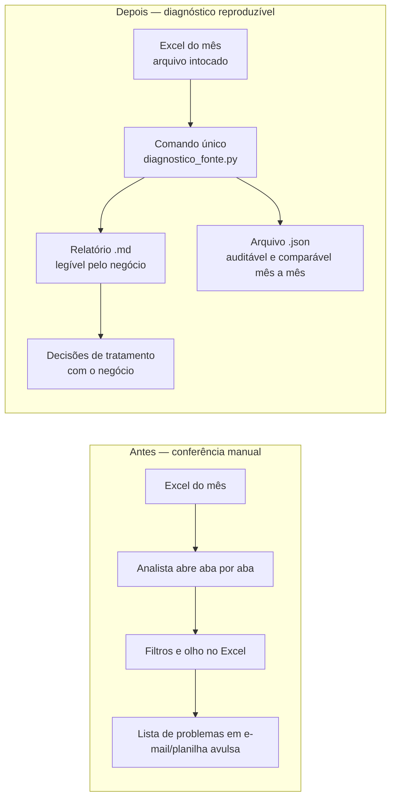

# Plano Visual Faseado — Diagnóstico de qualidade da fonte

**Fase do projeto:** fase 1 (leitura e entendimento da base) · **Tier da mudança:** 1 (funcional, sem regra econômica) · **Muda-numero:** não
**Issue:** #7 · **Ramo:** `feat/diagnostico-qualidade-fonte`

> Observação de processo: o padrão pede aprovação deste plano **antes** de implementar. Nesta rodada o consultor delegou o ciclo completo de forma autônoma; o plano foi escrito antes do código e a aprovação acontece na revisão do PR. Desvio registrado aqui de propósito — não é o fluxo padrão.

## O que este ciclo entrega, em uma frase

Um comando único que **olha** a base operacional do mês e diz, em relatório legível, o que existe e o que está estranho — sem consertar nada.

## Por que primeiro isto, e não o cálculo

As fórmulas de margem estão registradas como preliminares (TRUTH-001..005) e dependem da validação formal da controladoria. As regras de tratamento (o que fazer com pedido duplicado, cancelado, órfão ou incompleto) já existem no papel, mas cada uma decide **números entregues à diretoria** — território de mudança de resultado. Antes disso, o time precisa de um retrato confiável da fonte. Este ciclo entrega o retrato.

## Fases

| Fase | Nome de negócio | Entrega | Estado |
| --- | --- | --- | --- |
| 1 | Leitura da base do mês | Lê o Excel operacional (ou a massa sintética em CSV) sem alterar o arquivo de origem | concluída |
| 2 | Retrato da estrutura | Colunas descobertas, tipo de cada campo, quantidade de registros por base | concluída |
| 3 | Retrato dos problemas | Faltantes, identificadores repetidos, chaves sem correspondência, status e valores contraditórios | concluída |
| 4 | Relatório para decisão | Relatório em Markdown + arquivo JSON auditável, com a decisão pendente de cada achado | concluída |
| 5 | Conferência independente | Harness recalcula contagens, vazios, duplicidades e órfãos por caminho próprio e compara | concluída |

## Fluxo antes → depois

## O que muda

- Existe um comando único, repetível todo mês, que produz o mesmo retrato para a mesma entrada.
- Cada anomalia sai nomeada, com evidência (linha e identificador) e com a decisão que falta ao negócio.
- A conferência da massa deixa de depender de quem está olhando.

## O que NÃO muda neste ciclo

- Nenhum registro é corrigido, deduplicado, excluído ou completado.
- Nenhum identificador é normalizado — a semelhança entre `" c003 "` e `C003` é reportada como hipótese, não aplicada.
- Nenhum número de negócio é calculado: sem receita líquida, sem margem, sem ranking, sem lista de clientes-alerta.
- O arquivo de origem não é alterado (abertura somente leitura, conferida por SHA-256 antes e depois).
- Nenhuma TRUTH é criada ou alterada: anomalia observada não se torna regra aprovada.

## O que o consultor vê ao final

1. `outputs/diagnostico/diagnostico_<rótulo>.md` — o relatório que pode ser mostrado à controladoria.
2. `outputs/diagnostico/diagnostico_<rótulo>.json` — a mesma informação em formato comparável entre meses.
3. Uma lista curta de decisões pendentes do negócio, que alimenta o primeiro `/change-number`.

## Próximo ciclo (fora deste PR)

Com o retrato aprovado, o tratamento entra como mudança de resultado: regra por regra, com fonte, golden before/after e aprovação de quem valida número.
