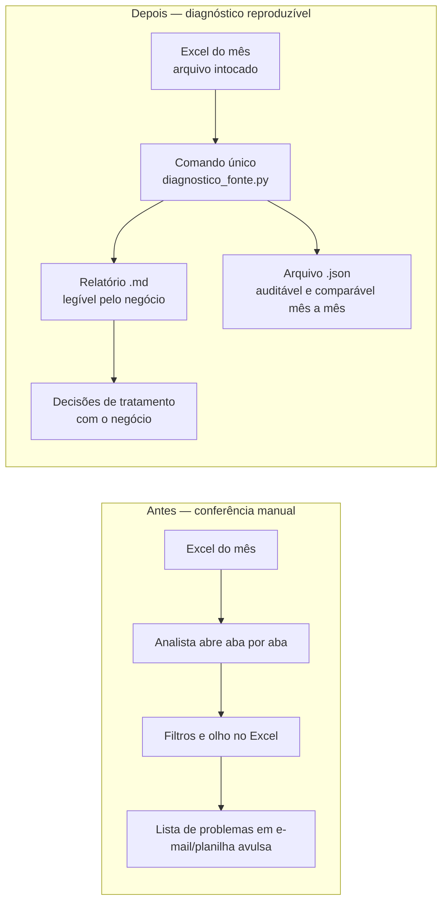

# Plano Visual Faseado — Diagnóstico de qualidade da fonte

**Fase do projeto:** fase 1 (leitura e entendimento da base) · **Tier da mudança:** 1 (funcional, sem regra econômica) · **Muda-numero:** não
**Issue:** #7 · **Ramo:** `feat/diagnostico-qualidade-fonte`

> ## Correção de procedência (2026-09-04)
>
> **Este documento foi produzido retrospectivamente.** Ele foi escrito **depois** do código, não antes: a implementação, o harness e os testes vieram primeiro, e o plano foi redigido em seguida — a tabela de fases marcando todas as cinco como "concluída" já denunciava isso. Portanto ele descreve, em parte, uma solução pronta.
>
> A nota original que ocupava este espaço dizia: *"Observação de processo: o padrão pede aprovação deste plano **antes** de implementar. Nesta rodada o consultor delegou o ciclo completo de forma autônoma; o plano foi escrito antes do código e a aprovação acontece na revisão do PR. Desvio registrado aqui de propósito — não é o fluxo padrão."* Ela fica citada aqui porque é evidência, mas **estava incorreta em dois pontos**: o plano não foi escrito antes do código, e a delegação de autonomia não autorizava dispensar a aprovação. O texto original permanece íntegro no histórico do Git (commit `f43434e`) — nada foi apagado.
>
> **A regra descumprida.** Passo 3 de `project-plugin/skills/build-feature/SKILL.md`: "Plano Visual Faseado (obrigatório antes de implementar) ... Aprovação do consultor ANTES de implementar." Gate instituído no core v0.2.0 a partir da avaliação do Teste 1, cuja percepção (b) era justamente a falta de artefatos faseados e visuais antes de implementar.
>
> **Nenhuma instrução do consultor autorizou ignorar o gate.** A autonomia concedida cobria executar o ciclo e escolher roteamento, tier e profundidade de validação — não consumir uma aprovação que só o consultor podia dar. Pela própria regra da autorização ("pedir input quando uma decisão de negócio ausente mudaria materialmente a implementação"), a aprovação do plano devia ter sido pedida.
>
> ### Decisões que de fato precederam o código
>
> Tomadas lendo PROJECT/TRUTHS/ACCEPTANCE/DATA_CATALOG antes da primeira linha, e rastreáveis no que o código faz: recorte estritamente observacional, sem tratamento nem cálculo; um único módulo em `src/`; contrato de estrutura declarado no topo do módulo, derivado do DATA_CATALOG; leitura CSV só com biblioteca padrão e `openpyxl` importado tardiamente apenas no caminho `.xlsx`; saídas `.md` + `.json` determinísticas em `outputs/`; harness com recomputação independente cobrindo contagens, vazios, duplicidades, órfãos, EX-01..07, determinismo e integridade da origem.
>
> ### Decisões que surgiram durante a implementação
>
> Nunca revistas antes de existir código: inventário de status por valor observado com os ids — introduzido porque o pedido cancelado O005 não aparecia em nenhum achado; `id` do achado passando a ser o identificador do registro em vez do valor sujo; regex de competência para o período observado; **enfraquecimento da verificação de indicador** no harness, de varredura de texto para inspeção de chaves, porque a versão original batia no nome do parâmetro `limiar_margem_servir_baixa` presente na fixture (ver KI-001 em `.project/KNOWN_ISSUES.md`); o runbook `docs/runbook/diagnostico-fonte.md`; o mecanismo de allowlist da suite de margens.
>
> ### Aprovado somente nesta revisão tardia (2026-09-04), pelo owner técnico
>
> O desenho geral deste plano; o recorte observacional para este primeiro ciclo; tier 1 e `Muda-numero: não` **para esta feature específica**, sem alterar o piso tier 2 das futuras regras de tratamento e cálculo; `.md` + `.json` como entregáveis; o vocabulário `anomalia` / `aviso` / `informativo` / `observado` / `hipótese`. Aprovado com uma exigência, aplicada neste ciclo: separar achados que exigem atenção de itens de perfil/inventário, para que o inventário de status não infle a contagem de problemas.
>
> **Não aprovado:** a allowlist da guarda 4 como controle comportamental. Limitação registrada como known issue (KI-001); correção estrutural é demanda separada no `aucta-dev-core`, fora deste PR.
>
> ### Recuperação
>
> Opção A (recuperar no PR existente), autorizada em 2026-09-04. Exceção formal EF-002 registrada na Issue #7 e em `.project/init-state.md`, válida exclusivamente para este ciclo e **sem criar precedente**: revisão de PR não equivale a aprovação retroativa de plano em nenhum ciclo futuro. Histórico preservado integralmente — sem amend, sem force-push, sem rebase destrutivo.

## O que este ciclo entrega, em uma frase

Um comando único que **olha** a base operacional do mês e diz, em relatório legível, o que existe e o que está estranho — sem consertar nada.

## Por que primeiro isto, e não o cálculo

As fórmulas de margem estão registradas como preliminares (TRUTH-001..005) e dependem da validação formal da controladoria. As regras de tratamento (o que fazer com pedido duplicado, cancelado, órfão ou incompleto) já existem no papel, mas cada uma decide **números entregues à diretoria** — território de mudança de resultado. Antes disso, o time precisa de um retrato confiável da fonte. Este ciclo entrega o retrato.

## Fases

| Fase | Nome de negócio | Entrega | Estado |
| --- | --- | --- | --- |
| 1 | Leitura da base do mês | Lê o Excel operacional (ou a massa sintética em CSV) sem alterar o arquivo de origem | concluída |
| 2 | Retrato da estrutura | Colunas descobertas, tipo de cada campo, quantidade de registros por base | concluída |
| 3 | Retrato dos problemas | Faltantes, identificadores repetidos, chaves sem correspondência, status e valores contraditórios | concluída |
| 4 | Relatório para decisão | Relatório em Markdown + arquivo JSON auditável, com a decisão pendente de cada achado | concluída |
| 5 | Conferência independente | Harness recalcula contagens, vazios, duplicidades e órfãos por caminho próprio e compara; suite do caminho `.xlsx` exige resultado idêntico ao caminho CSV | concluída |

*O encadeamento técnico das fases precedeu o código; os nomes de negócio e o formato de tabela foram redigidos depois (ver Correção de procedência).*

## Fluxo antes → depois

## O que muda

- Existe um comando único, repetível todo mês, que produz o mesmo retrato para a mesma entrada.
- Cada anomalia sai nomeada, com evidência (linha e identificador) e com a decisão que falta ao negócio.
- A conferência da massa deixa de depender de quem está olhando.

## O que NÃO muda neste ciclo

- Nenhum registro é corrigido, deduplicado, excluído ou completado.
- Nenhum identificador é normalizado — a semelhança entre `" c003 "` e `C003` é reportada como hipótese, não aplicada.
- Nenhum número de negócio é calculado: sem receita líquida, sem margem, sem ranking, sem lista de clientes-alerta.
- O arquivo de origem não é alterado (abertura somente leitura, conferida por SHA-256 antes e depois).
- Nenhuma TRUTH é criada ou alterada: anomalia observada não se torna regra aprovada.

## O que o consultor vê ao final

1. `outputs/diagnostico/diagnostico_<rótulo>.md` — o relatório que pode ser mostrado à controladoria.
2. `outputs/diagnostico/diagnostico_<rótulo>.json` — a mesma informação em formato comparável entre meses.
3. Uma lista curta de decisões pendentes do negócio, que alimenta o primeiro `/change-number` — derivada apenas dos achados de atenção, não do inventário.

O relatório separa **achados que exigem atenção** (anomalia e aviso, códigos `D-###`) de **perfil e inventário da fonte** (informativo, códigos `P-###`), com contadores independentes.

## Próximo ciclo (fora deste PR)

Com o retrato aprovado, o tratamento entra como mudança de resultado: regra por regra, com fonte, golden before/after e aprovação de quem valida número.
